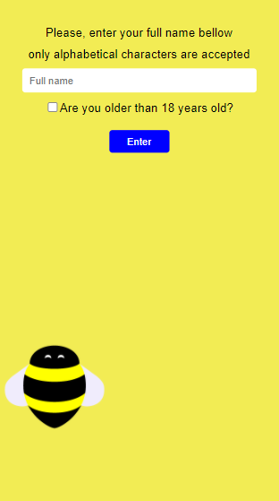
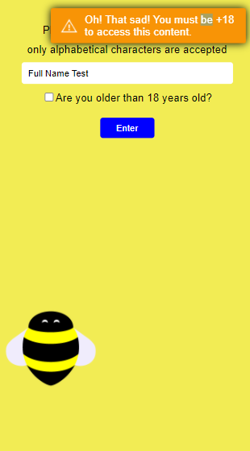
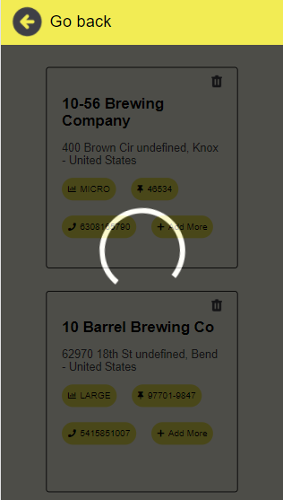
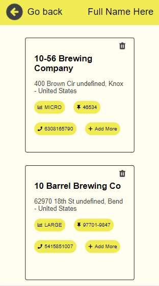
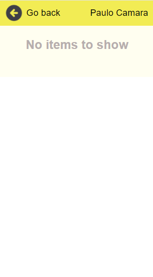
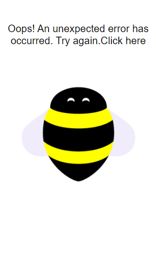

# Chalenge Bees

## Description
The project has three pages, where the first page must insert your full name and mark if you are over 18 years old. If the information is not filled in, a message will be given according to the reason for the error, but if the two information is entered by clicking the Enter button, then you will be directed to the screen with the list of breweries. On this second screen it will be possible to view the full name in the upper right corner and the back button (Which will take you to the previous page) in the upper left corner and the list of breweries on cards. Each card has a button in its upper right corner in the shape of a trash can, where by clicking we can delete the brewery. It is important to note that it is not possible to access the Brewery List screen before having filled in the fields on the Home page

### Folder structure
The "src" folder contains the components folder which in turn has the folder for each component, the "shared" folder, where the components that are shared between screens must be kept. There is also the "Pages" folder where the screen components are kept inside this folder.
The "context" folder is responsible for allocating the created React Contexts
The "scripts" folder stores any and all scripts that are necessary, at the moment the fetch request structure is stored there

## Technologies
- [React.JS](https://reactjs.org/docs/getting-started.html) 
- [Node Sass](https://www.npmjs.com/package/node-sass)
- [Styled Components](https://styled-components.com/) used to create and style components
- [Toastr](https://www.npmjs.com/package/toastr) used to menssage error/success/warning
- [Axios](https://axios-http.com/docs/intro) used to requests http
- [React Testing Library](https://testing-library.com/docs/react-testing-library/intro/) used to create unit tests
- [Amazon AWS S3](https://aws.amazon.com/pt/s3/) used to deploy

#
## Deploy
For better visualization in mobile device environments for responsiveness testing, a static site was deployed in AWS S3 at the following URL: http://bees-front-end.s3-website-us-east-1.amazonaws.com/


Home Page                                  |Home Page Message                                  |List Page Loading                                  |
:-----------------------------------------:|:-------------------------------------------------:|:-------------------------------------------------:|
  |  |  |

List Page                                 |Empty List                                 |Page Error                                |
:----------------------------------------:|:-----------------------------------------:|:----------------------------------------:|  
 | ||
#
## Bonus
- Project created with Typescript because I belive is a good pratice that facilitates maintenance.
- Created an Loading when the feth requests are doing.
- Validate user inputs in the home page.
- Did with git commit history keep the possibility to restore previous commits.
- Created an Error page for when the user navegate to unknow page, he is redirected this error page.
- I prefer use React Context to manager state global than use a library how Redux because it's simples states.
- I've created some unit tests, but I believe it would be nice to cover the whole system with tests for added security.

#
## Start local project
```
git clone https://github.com/paulo-camara/bees-front-end.git
cd bees-front-end
npm install
npm start
```
## Run unit tests
```
npm test
```
